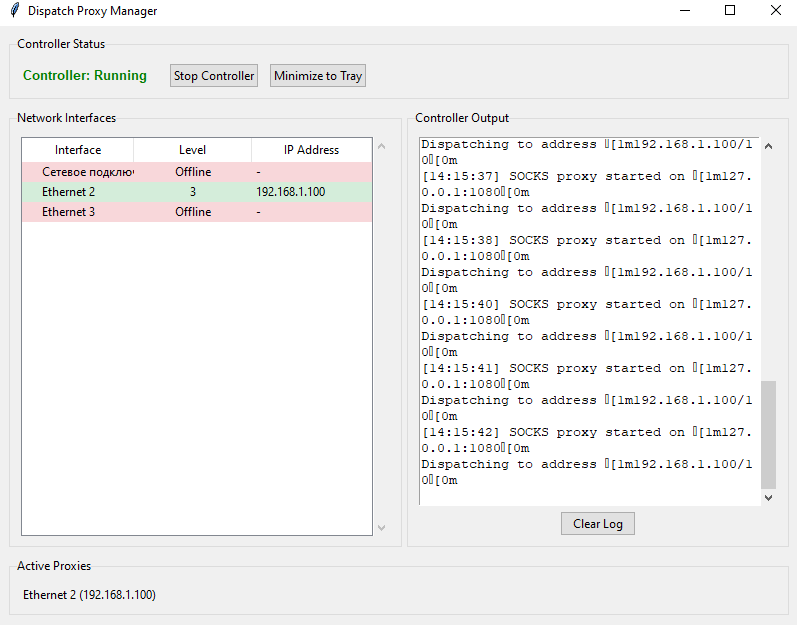

# Dispatch Proxy Manager



A Windows application that automatically manages dispatch proxy connections across multiple network interfaces, monitoring internet connectivity and dynamically routing traffic through available interfaces.
## Overview

The Dispatch Proxy Manager is a Python-based tool that continuously monitors your network interfaces, checks their internet connectivity levels, and automatically manages dispatch proxy instances to ensure optimal network access. It provides both a GUI interface and system tray integration for easy management.

I wanted a simple app to automatically add/remove my phone's connection from my dispatch proxy, when I either enable USB tethering or disable it, so, naturally, this is the project I made for it.
## Features

- Automatic Interface Monitoring: Continuously checks network interfaces for connectivity
- Smart Proxy Management: Automatically starts/stops dispatch proxy on available interfaces
- Four-Level Connectivity Detection:
    - **Level -1:** Disconnected
    - **Level 0:** Interface connected but no internet
    - **Level 1:** DNS resolution only
    - **Level 2:** Whitelisted sites accessible
    - **Level 3:** Full internet access
- System Tray Integration: Run minimized with full control from system tray
- Real-time Notifications: Windows toast notifications for connectivity changes
- Logging: Detailed output logging of all operations
- GUI Interface: User-friendly interface showing interface status and proxy information

## Prerequisites
- Python 3.10+ (tested with Python 3.10)
- dispatch.exe from [alexkirsz/dispatch](https://github.com/alexkirsz/dispatch/releases)
- Windows 10/11 (for toast notifications)

## Python Dependencies

To install all necessary Python dependencies, run the following command in your terminal:

```bash
pip install -r requirements.txt
```

This will install all required packages listed in `requirements.txt`, ensuring your environment is ready to run the application.


## Configuration

Create a .env file in the project directory with the following variables:
```env
# Path to dispatch.exe (relative or absolute)
DISPATCH_EXE=dispatch.exe

# Network interfaces to monitor with their priority mappings (bigger value = more priority)
# Format: {"Interface Name": priority}
INTERFACES={"Ethernet": 10, "Wi-Fi": 5, "Ethernet 2": 5}

# The domain to use for checking whitelisted (basic) access
WHITELISTED_URL=google.com
# The domain to use for checking full internet access
NOT_WHITELISTED_URL=youtube.com
```

### Finding Interface Names

Run the following command in Command Prompt to see available interface names:
```bash
dispatch.exe list
```

## Usage
Running the GUI Application

```bash
python GUI.py
```

Running as Console Application

```bash
python InternetController.py
```

## GUI Features
- Main Window
    - Controller Status: Shows if the proxy controller is running
    - Start/Stop Controller: Toggle proxy management
    - Minimize to Tray: Hide to system tray
    - Interface List: Shows all configured interfaces with their current level and IP
    - Active Proxies: Lists currently active proxy interfaces
    - Log Output: Displays real-time operation logs
- System Tray
    - Show Window
    - Start/Stop Controller
    - Exit
- Notifications on
    - Interface connectivity level changes
    - Interface connects/disconnects
    - Proxy controller starts/stops

## File Structure
```
.
├── InternetController.py   # Core logic for interface monitoring and proxy control
├── GUI.py                  # Graphical user interface
├── .env                    # Configuration file (create this)
├── dispatch.exe            # Proxy executable (download separately)
├── icon.ico                # Application icon (optional)
└── README.md               # This file
```

## Issues

For issues and feature requests, please check:
- Existing issues in the repository
- Dispatch documentation at https://github.com/alexkirsz/dispatch

Note: some of the functionality (namely ping function in InternetController.py) depends on system language. You may need to patch some code manually.


#### License

<sup>
Licensed under either of <a href="LICENSE-APACHE">Apache License, Version
2.0</a> or <a href="LICENSE-MIT">MIT license</a> at your option.
</sup>

<br>

<sub>
Unless you explicitly state otherwise, any contribution intentionally submitted
for inclusion in this crate by you, as defined in the Apache-2.0 license, shall
be dual licensed as above, without any additional terms or conditions.
</sub>
